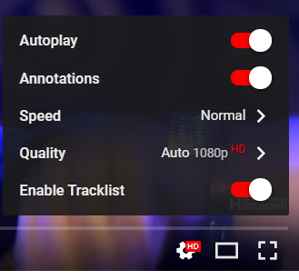
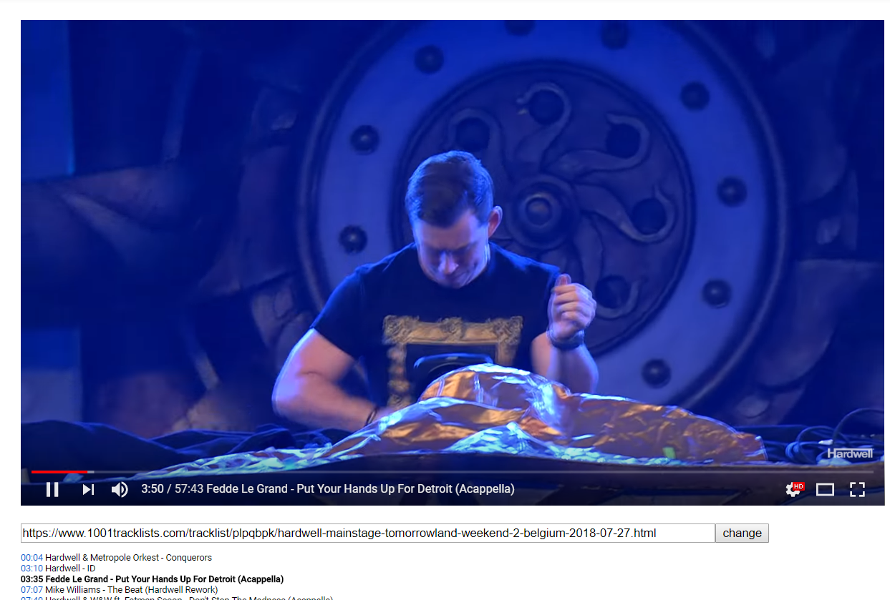

# 1001tracklists in YouTube

Insert 1001tracklists into YouTube player.

## Features

1. Show the title of the track playing in the YouTube player.
2. Jump to the start time of specified track directly

## Install

1. You need [Tampermonkey][tampermonkey] (chrome) or [Greasemonkey][greasemonkey] (Firefox) plugin first
2. Visit [the page on GreasyFork](https://greasyfork.org/en/scripts/370712-1001tracklists-in-youtube) and install the script.

## How to use?

1. Turn on "Enable Tracklist" in "Settings" of YouTube player.
2. Paste the 1001tracklists url in the input box under the player
3. Click "Fetch/Change" button
4. Enjoy!
5. If the plugin asks for permission, please choose allow. (request 1001tracklists.com from youtube.com need to bypass Access-Control-Allow-Origin)

##Screenshots

Switch in settings

When plugin is enabled

(Sample: [Hardwell Live at Tomorrowland 2018 (WEEK 2)](https://www.youtube.com/watch?v=UD_Nj0sNmpE) and the [tracklists](https://www.1001tracklists.com/tracklist/plpqbpk/hardwell-mainstage-tomorrowland-weekend-2-belgium-2018-07-27.html) on [1001tracklists](https://www.1001tracklists.com))

## TODO

1. Change the way of showing versus tracks 
2. Button on the right will disappear when track title is too long (or change to a larger display ;P )
3. Add SoundCloud support
4. Support history

(However I am a javascript beginner \_\(:з\)∠\)\_)